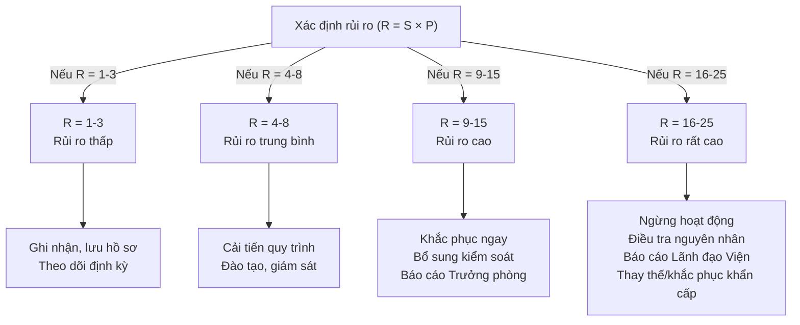

---
# Khối metadata AI — bắt buộc cho mọi văn bản kiểm soát (xem §7)
id: ETV.P01
title: "Thủ tục Giải quyết rủi ro và cơ hội"
type: Thu-tuc
owner: "(cập nhật — chức danh LĐP phụ trách Hệ thống quản lý)"
department: "Toàn Viện"
process: MP01_RuiRo
capability: CAP-17_ChatLuong
module: M01_RuiRo
effective_date: "22/04/2023"
revision: "02"
status: Da-phe-duyet
keywords: [rủi ro, cơ hội, đánh giá rủi ro, ma trận rủi ro, an toàn lao động, phòng cháy chữa cháy, ManLab, ISO 17025 §8.5]
related_documents: [ETV.QM, ETV.P14, ETV.P15]
iso_clause: ["ISO/IEC 17025:2017 §8.5", "ISO 9001:2015 §6.1"]
legal_basis: []
ai_tags: [risk-management, opportunity-management, risk-matrix, safety]
knowledge_category: HTQL-noi-bo
permission: Noi-bo
retention: "Vĩnh viễn (bản hiện hành) — xem chi tiết theo loại tại ETV.P.F 14.06"
digital_signature: "LĐV"
source: "Viện Kiểm định Công nghệ và Môi trường (ETV)"
supersedes: null
superseded_by: null
---
# THỦ TỤC GIẢI QUYẾT RỦI RO VÀ CƠ HỘI

|                           |                      |
| ------------------------- | -------------------- |
| **Mã số**         | ETV.P 01             |
| **Lần ban hành**  | 02                   |
| **Ngày ban hành** | 22/4/2023            |
| **Biên soạn**     | (cập nhật)  |
| **Soát xét**      | (cập nhật)       |
| **Phê duyệt**     | (cập nhật) |

> **Tình trạng bản này: ĐÃ PHÊ DUYỆT** — lần ban hành 02, hiệu lực từ ngày 22/4/2023.

## NHỮNG THAY ĐỔI ĐÃ CÓ

| Thời gian | Nội dung thay đổi | Lần ban hành |
| --------- | ------------------ | ------------ |
| 22/4/2019 | Ban hành lần thứ 1 | 01 |
| 15/3/2021 | Bổ sung quy định nhận diện, đánh giá rủi ro | 01 |
| 22/04/2023 | Ban hành lần thứ 2 | 02 |
| 22/04/2025 | Bổ sung chi tiết bảng hướng dẫn nhận diện, đánh giá rủi ro | 02 |

> **Chú ý:** Tài liệu nội bộ nghiêm cấm cung cấp cho bên ngoài khi chưa có sự đồng ý của Lãnh đạo Viện Kiểm định Công nghệ và Môi trường.

> **Ghi chú số hóa (AI):** Bản này là bản số hóa từ file PDF gốc đã phê duyệt (lần ban hành 02, hiệu lực 22/4/2023, gồm cả bổ sung 22/4/2025), phục vụ nạp vào ManLab/kho tri thức. Nội dung được giữ nguyên theo bản gốc; LĐP phụ trách Hệ thống quản lý cần đối chiếu với bản giấy/PDF gốc trước khi dùng bản Markdown này thay thế làm bản kiểm soát chính thức. Các đề xuất hoàn thiện thể thức (đánh số mục, dẫn chiếu phụ lục) ở bản này chỉ là chỉnh sửa trình bày, không làm thay đổi nội dung kỹ thuật đã phê duyệt — mọi thay đổi nội dung thực chất phải qua thủ tục soát xét/phê duyệt lần ban hành kế tiếp theo `ETV.P14`.

---

## I. MỤC ĐÍCH

Thủ tục này được xây dựng phù hợp với những yêu cầu tại mục 8.5 của Sổ tay chất lượng ETV.QM, qui định phạm vi, trách nhiệm và nội dung các bước tiến hành để hoạt động kiểm định, hiệu chuẩn, thử nghiệm phải được thực hiện một cách khách quan và phải được tổ chức và quản lý sao cho đảm bảo tính khách quan tại Phòng Đo lường Chất lượng (gọi tắt PTN) thuộc Viện Kiểm định Công nghệ và Môi trường.

## II. PHẠM VI ÁP DỤNG

Thủ tục này áp dụng tại PTN bao gồm tất cả các bộ phận có liên quan đến hoạt động của hệ thống quản lý theo ISO/IEC 17025:2017.

## III. TRÁCH NHIỆM

Viện trưởng Viện Kiểm định Công nghệ và Môi trường đảm bảo duy trì phân công công việc, cân đối nguồn nhân lực và không gây áp lực cho nhân viên.

Tất cả cán bộ PTN tham gia hoạt động giải quyết rủi ro theo phân công.

## IV. TÀI LIỆU THAM KHẢO

- ETV.QM: Sổ tay chất lượng
- ETV.P 14: Thủ tục kiểm soát tài liệu
- ISO 9000:2005: Hệ thống quản lý chất lượng - Cơ sở và từ vựng
- ISO/IEC 17025:2017: Yêu cầu chung về năng lực của các phòng thử nghiệm và hiệu chuẩn

## V. THUẬT NGỮ, ĐỊNH NGHĨA VÀ CHỮ VIẾT TẮT

### 5.1. Thuật ngữ và định nghĩa

- Năng lực: khả năng của một tổ chức để tạo sản phẩm, dịch vụ đáp ứng yêu cầu;
- Nhà cung cấp: tổ chức hay cá nhân cung cấp sản phẩm hay dịch vụ theo yêu cầu của PTN;
- Dịch vụ: được hiểu dịch vụ của nhà thầu phụ cung cấp dịch vụ cho PTN theo yêu cầu (ví dụ: dịch vụ kiểm định, hiệu chuẩn, thử nghiệm, cho thuê phương tiện đo v.v…);
- Đồ cung cấp: thiết bị, vật tư, chất chuẩn cần thiết cho hoạt động kiểm định, hiệu chuẩn, thử nghiệm của PTN.
- Đo lường: Kiểm định, hiệu chuẩn, thử nghiệm, quan trắc

### 5.2. Chữ viết tắt

- DV - ĐCC: Dịch vụ - đồ cung cấp
- P: Thủ tục
- LĐV: Lãnh đạo Viện
- NCC: Nhà cung cấp
- PTN: Phòng Đo lường Chất lượng
- QLCL: Quản lý chất lượng
- QLKT: Cán bộ quản lý kỹ thuật
- TP: Trưởng phòng

## VI. NỘI DUNG

| Các bước tiến hành | Trách nhiệm | Tài liệu |
| --- | --- | --- |
| **1. Xác định rủi ro** Các qui định của PTN có thể quản lý và hoạt động phát sinh rủi ro nên cần đánh giá rủi ro của các hoạt động để có thể đề xuất biện pháp loại trừ hoặc giảm thiểu thích hợp. Định kỳ hàng năm Trưởng phòng PTN/QLCL và các nhân sự sẽ họp để phân tích các nguồn gốc rủi ro trong hoạt động của Phòng để đề xuất các biện pháp xử lý thích hợp. Trong hoạt động của PTN bất kỳ thời điểm nào mà cán bộ quản lý và nhân sự xác định được rủi ro có thể xảy ra cần đề xuất tới Trưởng phòng để thực hiện xử lý thích hợp. | TP/QLCL, NV | ETV.P.F 01.01 |
| **2. Nguồn gốc để xác định rủi ro** Để có các dữ liệu có thể đánh giá rủi ro và đề xuất hành động xử lý có hiệu quả trong hoạt động của hệ thống quản lý và hoạt động cần cải tiến PTN thu thập thông tin từ các nguồn sau: + Đánh giá nội bộ + Kết quả xem xét của lãnh đạo + Đóng góp ý kiến của các nhân viên trong Phòng + Phàn nàn + Đánh giá bên ngoài + Đảm bảo giá trị của kết quả bằng TNTT/SSLP + Kỹ năng và kinh nghiệm của các cán bộ quản lý và nhân viên + Nguồn gốc khác… | TP/QLCL, NV | ETV.P.F 01.01 |
| **3. Cách thức thu thập và tiếp nhận thông tin xác định rủi ro để đề xuất hoạt động xử lý** Trong bất kỳ thời điểm nào thì nhân sự trong PTN đều có thể phân tích các rủi ro trong hoạt động của phòng để trình lên lãnh đạo Phòng thông qua Biểu mẫu Hành động khắc phục, giải quyết rủi ro, cải tiến và nộp cho TP/QLCL. Các nhân sự được phân công theo dõi xu hướng các dữ liệu kiểm soát trong PTN nếu thấy xu hướng dữ liệu không ổn định có thể lấy thông tin đó đề xuất hành động kiểm soát rủi ro lên trưởng Phòng và xu hướng đảm bảo tốt cũng như có thể thực hiện được tốt hơn thì đề xuất biện pháp cải tiến. Từ các dữ liệu kiểm soát chất lượng, thống kê dữ liệu hoạt động của hệ thống chất lượng để làm nguồn thông tin đầu vào cho cuộc họp xem xét của lãnh đạo để có nguồn dữ liệu về xác định rủi ro và đề xuất hành động giải quyết rủi ro thích hợp. Trước mỗi cuộc họp xem xét của lãnh đạo, các cán bộ quản lý lập các báo cáo về tình hình hoạt động ở phạm vi quản lý của mình và đưa ra các dữ liệu, xu hướng dữ liệu của một giai đoạn dựa trên các dữ liệu báo cáo. Thông qua cuộc họp xem xét của lãnh đạo hoặc đề xuất của nhân sự từ việc theo dõi dữ liệu hệ thống quản lý để đưa ra hành động xử lý, giải quyết rủi ro | NV | ETV.P.F 01.01 |
| **4. Giải quyết rủi ro** Tất cả các đề xuất về khả năng rủi ro đều được Trưởng phòng PTN/QLCL xem xét quyết định việc cần thiết thực hiện hay không. Trường hợp các đề xuất là cần thiết thì Trưởng phòng PTN/QLCL có thể quyết định. Sau khi các đề xuất về giải quyết rủi ro được duyệt thực hiện thì Trưởng phòng PTN/QLCL phân công các nhân viên thực hiện. Nhân viên thực hiện phải am hiểu lĩnh vực cần giải quyết rủi ro và cần có kinh nghiệm, hiểu biết về yêu cầu của hệ thống quản lý và các yêu cầu của ISO/IEC 17025 có thể làm việc theo nhóm. Hành động giải quyết rủi ro bắt đầu bằng việc phân tích nguyên nhân có thể gây ra rủi ro. Khi thấy cần thiết cần tham khảo ý kiến của các nhân sự có kinh nghiệm liên quan. Sau khi tìm hiểu nguyên nhân có thể gây ra rủi ro thì đề xuất hành động giải quyết thích hợp để ngăn chặn nguyên nhân gây ra rủi ro. Trình báo cáo tìm nguyên nhân và hành động giải quyết cụ thể lên Trưởng phòng PTN/QLCL để phê duyệt và chỉ định nhân viên kiểm tra hiệu quả việc giải quyết rủi ro và thời gian cần hoàn thành. Nhân sự được phân công thực hiện hành động giải quyết rủi ro theo đề xuất đã được duyệt và trong quá trình thực hiện nếu có vấn đề gì nẩy sinh có thể trao đổi với Trưởng phòng PTN/QLCL và có thể báo cáo ngay với người có thẩm quyền liên quan. Khi hoàn thành hành động giải quyết rủi ro được phân công nộp hồ sơ liên quan để nhân viên thẩm xét kiểm tra và xác nhận. | TP/QLCL, NV | ETV.P.F 01.01 |
| Nhân viên thẩm xét nhận thấy báo cáo, bằng chứng giải quyết rủi ro đạt yêu cầu thì ký xác nhận; nếu không đạt đề xuất thực hiện bổ sung. Trường hợp không thống nhất giữa nhân sự thực hiện và kiểm tra thì hồ sơ khắc phục được trình Trưởng phòng PTN/QLCL xem xét và quyết định xem xét cuối cùng. Kết thúc việc thực hiện giải quyết rủi ro thì nhân viên được giao nhiệm vụ thực hiện và kiểm tra nộp hồ sơ lại cho Trưởng phòng PTN/QLCL. Trưởng phòng PTN/QLCL tập hợp các báo cáo và bằng chứng giải quyết rủi ro để làm thông tin đầu vào cho cuộc họp xem xét của lãnh đạo. Toàn bộ hồ sơ liên quan giải quyết rủi ro được tổng hợp lại và lưu theo qui định của thủ tục Kiểm soát hồ sơ (ETV.P 15) + Hành động khắc phục, giải quyết rủi ro, cải tiến + Bằng chứng thực hiện giải quyết rủi ro (hoặc viện dẫn vị trí lưu giữ) | NV, TP/QLCL | ETV.P.F 01.01, ETV.P.F 01.02 |

### 5. Hướng dẫn chung cách nhận diện, đánh giá các nguy cơ, rủi ro

Nguyên tắc, phương pháp xác định đầu vào, đầu ra của hoạt động, nhận diện, đánh giá các nguy cơ, rủi ro theo các bước sau:

#### 5.1. Bước 1: Thu thập thông tin

- Căn cứ chức năng nhiệm vụ, công việc và các hoạt động (thường xuyên và không thường xuyên) của đơn vị.
- Mối quan hệ giữa hoạt động của đơn vị với đơn vị khác, liên quan đến hoạt động của Viện, hệ thống quản lý chất lượng.
- Các yếu tố ảnh hưởng đến hoạt động của đơn vị, ảnh hưởng đến hệ thống quản lý chất lượng.

#### 5.2. Bước 2: Xác định đầu vào, đầu ra của hoạt động, nhận diện các nguy cơ

Nhận diện tất cả các loại nguy cơ, rủi ro có thể phát sinh từ hoạt động của PTN, bao gồm:

a) **Hoạt động thường xuyên và không thường xuyên**:
- Kiểm định, hiệu chuẩn, thử nghiệm, quan trắc.
- Tiếp nhận, bảo quản, sử dụng thiết bị, dụng cụ, chuẩn đo lường.
- Hoạt động báo cáo, lập chứng chỉ, giao tiếp khách hàng.

b) **Mối quan hệ công việc**:
- Phối hợp giữa các bộ phận trong PTN.
- Phụ thuộc vào dịch vụ của nhà thầu phụ/nhà cung cấp.

c) **Yếu tố con người**:
- Trình độ, năng lực, kinh nghiệm, hành vi nghề nghiệp của nhân viên.
- Rủi ro do sai sót thao tác, nhầm lẫn khi tính toán, nhập số liệu.

d) **Yếu tố bên ngoài**:
- Thay đổi quy định pháp luật, tiêu chuẩn quốc tế.
- Khiếu nại của khách hàng, sự cố về nguồn cung.

đ) **Hạ tầng, trang thiết bị, vật tư**:
- Thiết bị xuống cấp, hiệu chuẩn quá hạn.
- Chất chuẩn, hóa chất bảo quản không đúng.

e) **Thay đổi và cải tiến**:
- Thay đổi nhân sự chủ chốt, quy trình, thiết bị, phần mềm.
- Triển khai phương pháp thử mới hoặc công nghệ mới.

#### 5.3. Bước 3: Đánh giá hậu quả (S – Severity)

Hậu quả là mức độ ảnh hưởng tiêu cực nếu rủi ro xảy ra.

*Bảng 1. Mức độ hậu quả (S)*

| Điểm | Mức độ | Mô tả | Ví dụ trong PTN |
| --- | --- | --- | --- |
| 1 | Không đáng kể | Ảnh hưởng rất nhỏ, không ảnh hưởng đến kết quả hoặc có thể khắc phục ngay | Sai sót chính tả trong chứng chỉ, nhập nhầm số liệu nhưng được phát hiện trước khi phát hành |
| 2 | Nhẹ | Ảnh hưởng nhỏ, có thể gây chậm tiến độ nhưng không ảnh hưởng đến độ tin cậy kết quả | Thiết bị phụ trợ hỏng nhưng có thiết bị thay thế ngay |
| 3 | Trung bình | Ảnh hưởng đến độ tin cậy kết quả, cần khắc phục, có nguy cơ khiếu nại | Sai sót khi thao tác làm phải lặp lại phép thử, chậm giao kết quả cho khách hàng |
| 4 | Nghiêm trọng | Ảnh hưởng lớn, có thể gây mất kết quả đo lường, thiệt hại tài chính hoặc mất uy tín | Kết quả kiểm định/hiệu chuẩn sai gửi cho khách hàng, gây khiếu nại |
| 5 | Rất nghiêm trọng | Gây hậu quả nghiêm trọng đến tính hợp lệ, uy tín, pháp lý | Mất chứng chỉ công nhận, vi phạm pháp luật, gây thiệt hại lớn cho khách hàng và Viện |

#### 5.4. Bước 4: Đánh giá khả năng xảy ra (P – Possibility)

*Bảng 2. Khả năng xảy ra (P)*

| Điểm | Mức độ | Ví dụ trong PTN |
| --- | --- | --- |
| 1 | Rất thấp | Hiếm khi, khó có khả năng xảy ra — sự cố thiết bị hiếm gặp, đã có biện pháp dự phòng |
| 2 | Thấp | Thỉnh thoảng, xảy ra ít khi — sai sót ghi nhãn mẫu, khoảng 1–2 lần/năm |
| 3 | Trung bình | Có thể xảy ra nhiều lần — sai số do thao tác chưa chuẩn, 3–5 lần/năm |
| 4 | Cao | Xảy ra thường xuyên — sai sót nhập liệu, báo cáo chậm, nhiều lần trong năm |
| 5 | Rất cao | Gần như chắc chắn xảy ra — lỗi hệ thống phần mềm, thiết bị cũ thường xuyên hỏng, chưa được thay thế |

#### 5.5. Bước 5: Đánh giá rủi ro

- Đánh giá các nguy cơ, rủi ro cần phải xem xét hậu quả và thiệt hại mà hoạt động đó gây ra như: ảnh hưởng đến sức khỏe, tính mạng con người, gây thiệt hại về kinh tế, gây cản trở cho hoạt động của các đơn vị liên quan… để phân loại theo 3 mức (cao, thấp, trung bình) căn cứ vào điểm rủi ro.
- Mỗi hoạt động có thể có nhiều nguy cơ, rủi ro và phải đánh giá riêng biệt đối với mỗi nguy cơ, rủi ro.

Xác định điểm rủi ro theo công thức:

**R = S × P**

*Bảng 3. Phân loại mức rủi ro*

| Điểm R | Mức rủi ro | Diễn giải | Hành động yêu cầu |
| --- | --- | --- | --- |
| 1 – 3 | Thấp | Có thể chấp nhận. Ảnh hưởng không đáng kể, biện pháp hiện có đủ kiểm soát. | Ghi nhận, lưu hồ sơ, theo dõi định kỳ |
| 4 – 8 | Trung bình | Chấp nhận được nhưng cần giám sát. Có thể gây ảnh hưởng nếu tái diễn. | Cải tiến quy trình hoặc đào tạo nhân viên |
| 9 – 15 | Cao | Không thể chấp nhận ngay, cần giảm thiểu. Nếu không kiểm soát sẽ ảnh hưởng nghiêm trọng. | Áp dụng ngay biện pháp khắc phục, bổ sung kiểm soát |
| 16 – 25 | Rất cao | Không chấp nhận. Phải dừng hoạt động liên quan cho đến khi xử lý. | Ngừng hoạt động, điều tra nguyên nhân, đưa ra phương án thay thế |

*Bảng 4. Ma trận đánh giá mức rủi ro (R = S × P)*

| Khả năng \ Hậu quả | 5 | 4 | 3 | 2 | 1 | Mức độ rủi ro |
| --- | --- | --- | --- | --- | --- | --- |
| Rất cao (5) | 25 | 20 | 15 | 10 | 5 | Rủi ro rất cao (từ vùng 16 đến 25) |
| Cao (4) | 20 | 16 | 12 | 8 | 4 | Rủi ro cao (từ vùng 9 đến 15) |
| Trung bình (3) | 15 | 12 | 9 | 6 | 3 | Rủi ro trung bình (từ vùng 4 đến 8) |
| Thấp (2) | 10 | 8 | 6 | 4 | 2 | Rủi ro thấp (từ vùng 1 đến 3) |
| Rất thấp (1) | 5 | 4 | 3 | 2 | 1 | |

**Diễn giải ma trận rủi ro:**

- **Vùng xanh (1 – 3 điểm) → Rủi ro thấp**: Chấp nhận được, không cần biện pháp bổ sung. Chỉ cần ghi nhận và xem xét định kỳ.
- **Vùng vàng (4 – 8 điểm) → Rủi ro trung bình**: Có thể chấp nhận nhưng phải giám sát chặt chẽ. Đề xuất cải tiến, đào tạo hoặc điều chỉnh quy trình.
- **Vùng cam (9 – 15 điểm) → Rủi ro cao**: Không chấp nhận nếu không giảm thiểu. Cần áp dụng ngay biện pháp khắc phục để giảm xuống mức trung bình/thấp.
- **Vùng đỏ (16 – 25 điểm) → Rủi ro rất cao**: Không chấp nhận trong bất kỳ trường hợp nào. Phải dừng hoạt động liên quan, báo cáo lãnh đạo, áp dụng biện pháp khẩn cấp.

#### 5.6. Bước 6: Biện pháp kiểm soát

Các biện pháp kiểm soát, phòng ngừa rủi ro được lựa chọn dựa trên mức độ rủi ro (R = S × P) đã đánh giá.

*Sơ đồ quy trình quyết định hành động theo mức rủi ro*

##### 5.6.1. Rủi ro thấp (R = 1 – 3)

- **Đặc điểm**: Ảnh hưởng nhỏ, hiếm khi xảy ra, không gây gián đoạn hoạt động của PTN.
- **Hành động**:
  - Ghi nhận vào hồ sơ quản lý rủi ro.
  - Duy trì biện pháp kiểm soát hiện có, chưa cần bổ sung hành động mới.
  - Theo dõi định kỳ trong cuộc họp xem xét lãnh đạo hoặc đánh giá nội bộ.
- **Trách nhiệm**: Nhân viên trực tiếp thực hiện ghi nhận; TP/QLCL lưu hồ sơ.
- **Ví dụ**: Sai sót chính tả trong chứng chỉ hiệu chuẩn, nhập nhầm số liệu nhưng phát hiện kịp thời trước khi phát hành.

##### 5.6.2. Rủi ro trung bình (R = 4 – 8)

- **Đặc điểm**: Có thể gây ảnh hưởng đến chất lượng hoặc tiến độ nếu tái diễn, nhưng vẫn trong khả năng kiểm soát.
- **Hành động**:
  - Xem xét và cải tiến quy trình hiện có.
  - Tổ chức đào tạo, hướng dẫn lại nhân viên.
  - Tăng cường kiểm tra, giám sát tần suất cao hơn.
- **Trách nhiệm**: TP/QLCL đưa ra hành động cải tiến; Nhân viên thực hiện theo hướng dẫn mới.
- **Ví dụ**: Sai sót trong ghi nhãn mẫu, báo cáo chậm tiến độ cho khách hàng nhưng có thể khắc phục kịp thời.

##### 5.6.3. Rủi ro cao (R = 9 – 15)

- **Đặc điểm**: Không chấp nhận nếu không giảm thiểu; có nguy cơ ảnh hưởng nghiêm trọng đến kết quả thử nghiệm/hiệu chuẩn và uy tín PTN.
- **Hành động**:
  - Phân tích nguyên nhân gốc rễ bằng các công cụ (Ishikawa, 5 Why, FMEA…).
  - Đưa ra hành động khắc phục ngay lập tức.
  - Bổ sung hoặc sửa đổi quy trình, biểu mẫu, hướng dẫn thao tác.
  - Áp dụng thêm biện pháp kiểm soát kỹ thuật (thiết bị dự phòng, phần mềm kiểm tra chéo, đối chiếu kết quả…).
  - Báo cáo cho Trưởng phòng để giám sát.
- **Trách nhiệm**: TP/QLCL phê duyệt biện pháp; Nhân viên thực hiện; Lãnh đạo Viện được thông báo.
- **Ví dụ**: Sai sót trong quy trình hiệu chuẩn khiến kết quả gửi cho khách hàng không chính xác; thiết bị đo quan trọng quá hạn hiệu chuẩn nhưng chưa được phát hiện.

##### 5.6.4. Rủi ro rất cao (R = 16 – 25)

- **Đặc điểm**: Không chấp nhận được trong bất kỳ tình huống nào; nếu xảy ra sẽ gây hậu quả nghiêm trọng về pháp lý, uy tín hoặc an toàn.
- **Hành động**:
  - Ngừng ngay hoạt động liên quan cho đến khi rủi ro được xử lý.
  - Thực hiện điều tra nguyên nhân, lập báo cáo sự cố.
  - Đề xuất phương án thay thế hoặc khắc phục khẩn cấp.
  - Báo cáo ngay cho Lãnh đạo Viện, có thể thông báo cho cơ quan công nhận (nếu liên quan đến phạm vi ISO/IEC 17025).
  - Sau khi khắc phục phải kiểm chứng hiệu quả trước khi tiếp tục hoạt động.
- **Trách nhiệm**: Nhân viên báo cáo sự cố; TP/QLCL ra quyết định ngừng hoạt động; Lãnh đạo Viện chỉ đạo và phê duyệt biện pháp khẩn cấp.
- **Ví dụ**: Mất chứng chỉ công nhận ISO/IEC 17025; thiết bị đo bị hỏng nghiêm trọng gây sai toàn bộ kết quả; mất mẫu thử nghiệm quan trọng của khách hàng.

#### 5.7. Tần suất

Việc xem xét, nhận diện, xác định các nguy cơ và đánh giá rủi ro được tiến hành khi:

- Khi xây dựng hệ thống quản lý.
- Kết quả hoạt động của hệ thống quản lý điều hành không đáp ứng được yêu cầu mong muốn.
- Thay đổi cơ cấu tổ chức: thay đổi hoạt động của đơn vị, thay đổi chức năng nhiệm vụ.
- Xây dựng/thay đổi cơ sở hạ tầng.
- Triển khai hoạt động mới (bao gồm cả việc sử dụng thiết bị/công nghệ mới).
- Có yêu cầu khác từ các bên quan tâm (nội bộ hay bên ngoài).
- Nếu không có các yếu tố trên việc nhận diện các nguy cơ, rủi ro cho các quá trình hoạt động tại Phòng được tiến hành định kỳ năm/1 lần vào kỳ đánh giá nội bộ toàn bộ hoạt động của Phòng.

#### 5.8. Phê duyệt biện pháp kiểm soát

Trong một số trường hợp hợp theo yêu cầu của khách hàng thì việc phê duyệt các biện pháp kiểm soát cần có sự thống nhất với khách hàng.

### 6. HƯỚNG DẪN CÁCH NHẬN DIỆN, ĐÁNH GIÁ CÁC NGUY CƠ, RỦI RO VỀ AN TOÀN (CHÁY NỔ VÀ LAO ĐỘNG)

#### 6.1. Xác định mối nguy

Xác định tất cả các loại nguy hiểm (yếu tố nguy hiểm, yếu tố có hại), nguồn gốc và nguyên nhân gây ra các nguy hiểm đó cũng như hậu quả có thể xảy ra của nó đối với con người tại tổ chức hoạt động vật liệu nổ công nghiệp cũng như những người không thuộc tổ chức nhưng hiện diện trong khu vực nghiên cứu, sản xuất, bảo quản, sử dụng, tiêu hủy.

Các nội dung cần phải xem xét đến khi xác định mối nguy gồm:

a) Các hoạt động thường xuyên và không thường xuyên;
b) Các hoạt động của những người có khả năng tiếp cận đến khu vực nghiên cứu, sản xuất, bảo quản, sử dụng, tiêu hủy;
c) Các hành vi, khả năng và các nhân tố liên quan đến con người khác;
d) Xác định các mối nguy bắt nguồn từ bên ngoài nơi làm việc mà có ảnh hưởng xấu đến sức khỏe, an toàn của những người chịu ảnh hưởng kiểm soát của tổ chức trong phạm vi nơi làm việc;
đ) Các mối nguy do hoạt động dưới sự kiểm soát của tổ chức tạo ra trong vùng lân cận của nơi làm việc;
e) Cơ sở hạ tầng, trang thiết bị và vật liệu tại nơi làm việc do tổ chức hay người khác cung cấp;
g) Các thay đổi hay đề xuất thay đổi trong tổ chức, đối với các hoạt động, hay vật tư;
h) Các điều chỉnh đối với hệ thống quản lý an toàn, sức khỏe và môi trường bao gồm các thay đổi mang tính tạm thời và ảnh hưởng của chúng đối với việc điều hành, các quá trình và các hoạt động;
k) Việc thiết kế khu vực làm việc, các quá trình, việc lắp đặt, máy, thiết bị, các thủ tục điều hành và tổ chức công việc, bao gồm việc thích ứng với khả năng của con người.

#### 6.2. Xác định các giải pháp kiểm soát các mối nguy hiểm có sẵn

- Các giải pháp phải là giải pháp đã được thực hiện trong thực tế, đã được ban hành trong nội quy, quy trình, quy định về an toàn, phiếu công tác…, không phải là giải pháp mà người đánh giá đặt ra trong quá trình đánh giá.
- Yêu cầu các giải pháp kiểm soát mối nguy hiểm có sẵn phải được liệt kê: Ngắn gọn, chính xác, đầy đủ và càng cụ thể càng tốt. Cũng cần xem xét hiệu quả của các giải pháp có sẵn trong thực tế.

#### 6.3. Đánh giá hậu quả của các mối nguy hiểm đã được xác định

Hậu quả là mức độ của chấn thương hoặc thiệt hại gây ra bởi tai nạn/sự cố, ốm đau từ mối nguy hiểm tại nơi làm việc. Hậu quả có thể được chia làm nhiều loại khác nhau dựa trên mức độ sự cố, thương tật.

| Hậu quả | Mô tả |
| --- | --- |
| Nhẹ | Không chấn thương, chấn thương hoặc ốm đau chỉ yêu cầu sơ cứu (bao gồm các vết đứt và trầy xước nhỏ, sưng tấy, ốm đau với lo lắng tạm thời) |
| Trung bình | Chấn thương yêu cầu điều trị y tế hoặc ốm đau dẫn đến ốm yếu tàn tật (bao gồm vết rách, bỏng, bong gân, gãy nhỏ, viêm da, điếc, …) |
| Nặng | Chết người, chấn thương trầm trọng hoặc bệnh nghề nghiệp có thể làm chết người (bao gồm cụt chân tay, gãy xương lớn, đa chấn thương, ung thư nghề nghiệp, nhiễm độc cấp tính và chết người) |

Đánh giá hậu quả chia thành 5 cấp độ với mức điểm như bảng sau đây:

| Điểm | Mô tả | Diễn giải |
| --- | --- | --- |
| 5 | Thảm khốc | Tử vong |
| 4 | Cao | Thương tật nghiêm trọng vĩnh viễn |
| 3 | Trung bình | Cần điều trị y tế, mất ngày công |
| 2 | Nhẹ | Điều trị y tế (có thể quay lại làm việc) |
| 1 | Không đáng kể | Điều trị sơ cứu (có thể quay lại làm việc) |

#### 6.4. Xác định khả năng xuất hiện của tai nạn, sự cố hoặc ốm đau phát sinh từ mối nguy hiểm

Bên cạnh việc xác định hậu quả có thể xảy ra đối với mỗi mối nguy hiểm, cần thiết phải xác định khả năng xuất hiện (hay tần suất) của tai nạn, sự cố hoặc ốm đau phát sinh từ mối nguy hiểm.

| Khả năng xảy ra | Mô tả |
| --- | --- |
| Hiếm khi | Ít có khả năng xuất hiện |
| Thỉnh thoảng | Có thể hoặc đã biết xuất hiện |
| Thường xuyên | Xuất hiện thông thường hoặc lặp lại |

Xác định khả năng xuất hiện chia làm 5 cấp độ với mức điểm như bảng sau đây:

| Điểm | Mô tả | Diễn giải |
| --- | --- | --- |
| 5 | Sẽ xảy ra ít nhất một lần trong năm (Gần như chắc chắn) | Khả năng thường xuyên xảy ra trong vòng đời của một cá nhân hoặc hệ thống hoặc rất thường xuyên xảy ra trong hoạt động với số lượng lớn của các thành phần tương tự. |
| 4 | Một lần trong 5 năm (Có khả năng xảy ra) | Khả năng xảy ra vài lần trong vòng đời của một cá nhân hoặc hệ thống trong hoạt động với số lớn của các thành phần tương tự. Hoặc xảy ra với xác suất 1/5000 lần thực hiện công việc. Hoặc xảy ra với xác suất 1/500 người thực hiện công việc. |
| 3 | Một lần trong 10 năm (Có thể xảy ra) | Khả năng đôi khi xảy ra trong vòng đời của một cá nhân hoặc hệ thống hoặc được trông đợi xảy ra một cách hợp lý trong đời với số lượng lớn các thành phần tương tự. Hoặc xảy ra với xác suất 1/50 000 lần thực hiện công việc. Hoặc xảy ra với xác suất 1/5000 người thực hiện công việc. |
| 2 | Một lần trong 15 năm (Ít khi xảy ra) | Đôi khi có thể xảy ra trong vòng đời của một cá nhân hoặc hệ thống hoặc trông đợi xảy ra một cách hợp lý trong đời của một số lớn các thành phần tương tự. Hoặc xảy ra với xác suất 1/100 000 lần thực hiện công việc. Hoặc xảy ra với xác suất 1/10 000 người thực hiện công việc. |
| 1 | Không trông đợi có thể xảy ra trong vòng đời của hoạt động (Hiếm khi xảy ra) | Không chắc có thể xảy ra trong vòng đời của một cá thể hoặc hệ thống mà nó chỉ có thể bằng cách giả định chứ không phải bằng trải nghiệm. Hiếm khi xảy ra trong đời của một số lớn thành phần tương tự. |

#### 6.5. Đánh giá mức rủi ro dựa trên hậu quả và khả năng xảy ra. Lựa chọn ma trận rủi ro

Sau khi xác định các biện pháp kiểm soát mối nguy hiểm có sẵn, khả năng xảy ra và hậu quả của mối nguy hiểm, việc đánh giá mức độ rủi ro được thực hiện bằng cách sử dụng ma trận rủi ro.

Mức rủi ro được phân loại thành thấp, trung bình và cao và tuỳ thuộc vào sự kết hợp giữa hậu quả và khả năng xảy ra.

**Xác định mức rủi ro (R) có thể xác định:**

| Khả năng xảy ra \ hậu quả | Hiếm khi | Thỉnh thoảng | Thường xuyên |
| --- | --- | --- | --- |
| Nặng | Trung bình | Cao | Cao |
| Trung bình | Thấp | Trung bình | Cao |
| Nhẹ | Thấp | Thấp | Trung bình |

Xác định mức độ rủi ro được đánh giá theo Ma trận như trong bảng để phân loại, đánh giá rủi ro cụ thể như sau:

| Khả năng \ Hậu quả | 5 | 4 | 3 | 2 | 1 | Mức độ rủi ro |
| --- | --- | --- | --- | --- | --- | --- |
| Gần như chắc chắn (5) | 25 | 20 | 15 | 10 | 5 | Rủi ro cực cao (từ vùng 16 đến 25) |
| Có khả năng xảy ra (4) | 20 | 16 | 12 | 8 | 4 | Rủi ro cao (từ vùng 9 đến 15) |
| Có thể xảy ra (3) | 15 | 12 | 9 | 6 | 3 | Rủi ro trung bình (từ vùng 4 đến 8) |
| Ít khi xảy ra (2) | 10 | 8 | 6 | 4 | 2 | Rủi ro thấp (từ vùng 1 đến 3) |
| Hiếm khi xảy ra (1) | 5 | 4 | 3 | 2 | 1 | |

- **Vùng (từ 1 đến 3)** là vùng rủi ro thấp – chấp nhận rộng rãi. Nếu rủi ro ước tính vào vùng này, các biện pháp giảm rủi ro hiện hữu đã đầy đủ, cho phép tiếp tục hoạt động và không cần phải đưa ra bất kỳ biện pháp bổ sung nào.
- **Vùng (từ 4 đến 8)** là vùng rủi ro trung bình – chấp nhận được. Nếu rủi ro ước tính vào vùng này, các biện pháp giảm rủi ro hiện hữu đã đầy đủ, cho phép tiếp tục hoạt động và không cần phải đưa ra bất kỳ biện pháp bổ sung nào.
- **Vùng (từ 9 đến 15)** là vùng rủi ro cao phải được giảm thiểu xuống mức thấp nhất phù hợp thực tế. Nếu rủi ro ước tính vào vùng này cần cân nhắc giảm rủi ro tới một mức mà nếu áp dụng thêm các biện pháp giảm rủi ro thì sẽ không hiệu quả hoặc thiếu thực tế.
- **Vùng (từ 16 đến 25)** là vùng rủi ro cực cao – không chấp nhận được. Nếu rủi ro ước tính vào vùng này thì phải dừng hoạt động và áp dụng bổ sung các biện pháp để giảm thiểu rủi ro.

#### 6.6. Các biện pháp phòng ngừa và kiểm soát rủi ro về an toàn (cháy nổ và lao động)

##### 6.6.1. Các biện pháp về kỹ thuật an toàn và phòng chống cháy nổ

a) Chế tạo, sửa chữa, mua sắm các thiết bị, bộ phận, dụng cụ nhằm mục đích che, chắn, hãm, đóng, mở các máy, thiết bị, bộ phận, công trình, khu vực nguy hiểm, có nguy cơ gây sự cố, tai nạn lao động;
b) Các giá đề nguyên vật liệu, thành phẩm;
c) Hệ thống chống sét, chống rò điện;
d) Các thiết bị báo động bằng màu sắc, ánh sáng, tiếng động …
đ) Đặt biển báo;
e) Mua sắm, sản xuất các thiết bị, trang bị phòng cháy chữa cháy;
g) Tổ chức lại nơi làm việc phù hợp với người lao động;
h) Di chuyển các bộ phận sản xuất, kho chứa các chất độc hại, dễ cháy nổ ra xa nơi có nhiều người qua lại;
i) Kiểm định máy, thiết bị, vật tư có yêu cầu nghiêm ngặt về an toàn – vệ sinh lao động;
k) Các biện pháp khác phù hợp với tình hình thực tế của cơ sở.

##### 6.6.2. Các biện pháp về kỹ thuật vệ sinh lao động phòng chống độc hại, cải thiện điều kiện lao động, bảo vệ môi trường

a) Lắp đặt các quạt thông gió, hệ thống hút bụi, hút hơi khí độc;
b) Nâng cấp, hoàn thiện làm cho nhà xưởng thông thoáng, chống nóng, ồn và các yếu tố độc hại lan truyền;
c) Xây dựng, cải tạo nhà tắm;
d) Lắp đặt máy giặt, máy tẩy chất độc;
đ) Đo đạc các yếu tố môi trường lao động;
e) Thực hiện việc xử lý chất thải nguy hại;
g) Nhà vệ sinh;
h) Các biện pháp khác phù hợp với tình hình thực tế của cơ sở.

##### 6.6.3. Mua sắm trang thiết bị bảo vệ cá nhân

a) Dây an toàn; mặt nạ phòng độc; tất chống lạnh; tất chống vắt; ủng cách điện; ủng chịu axít; mũ bao tóc, mũ chống chấn thương sọ não; khẩu trang chống bụi; bao tai chống ồn; quần áo chống phóng xạ, chống điện từ trường, quần áo chống rét, quần áo chịu nhiệt v.v….
b) Các trang thiết bị khác phù hợp với tình hình thực tế của cơ sở.

##### 6.6.4. Chăm sóc sức khỏe người lao động

a) Khám sức khỏe khi tuyển dụng;
b) Khám sức khỏe định kỳ;
c) Khám phát hiện bệnh nghề nghiệp;
d) Bồi dưỡng bằng hiện vật;
đ) Điều dưỡng và phục hồi chức năng cho người lao động; …

##### 6.6.5. Tuyên truyền giáo dục, huấn luyện về an toàn - vệ sinh lao động

a) Tổ chức huấn luyện về an toàn - vệ sinh lao động cho người sử dụng lao động, người lao động;
b) Chiếu phim, tham quan triển lãm an toàn - vệ sinh lao động;
c) Tổ chức thi an toàn - vệ sinh viên giỏi;
d) Tổ chức thi viết, thi vẽ đề xuất các biện pháp tăng cường công tác an toàn - vệ sinh lao động;
đ) Kẻ pa nô, áp phích, tranh an toàn lao động; mua tài liệu, tạp chí an toàn - vệ sinh lao động;
e) Phát các bản tin về an toàn - vệ sinh lao động trên các phương tiện truyền thông của cơ sở lao động;
g) Các biện pháp, hình thức tuyên truyền giáo dục, huấn luyện về an toàn - vệ sinh lao động khác phù hợp với tình hình thực tế của cơ sở.

### 7. Cập nhật bảng tổng hợp chức năng nhiệm vụ và quản lý rủi ro, cập nhật hệ thống tài liệu

Sau khi hoàn thành việc nhận diện rủi ro và xác định biện pháp để kiểm soát thì phải gửi lại "Phiếu nhận diện và đánh giá rủi ro" và các tài liệu liên quan về quản lý nguy cơ, rủi ro cho Trưởng Phòng/QLCL để tổng hợp, cập nhật.

### 8. Theo dõi thực hiện

- Đối với các công đoạn thủ tục nào có nguy cơ có rủi ro cao, nhân viên được giao quản lý là người chịu trách nhiệm giám sát các biện pháp kiểm soát đối với nguy cơ đó.
- Trưởng phòng/QLCL chịu trách nhiệm tổng hợp tất cả các nguy cơ có rủi ro trong Phòng để theo dõi và kiểm soát chung.
- Các tiêu chí định lượng để theo dõi hiệu quả thực hiện thủ tục này (tỷ lệ xử lý rủi ro đạt yêu cầu, thời gian xử lý, mức giảm điểm rủi ro, tỷ lệ tuân thủ lưu hồ sơ) — xem **Phụ lục B**.

## VII. HƯỚNG DẪN VÀ BIỂU MẪU ÁP DỤNG

- ETV.P.F 01.01 — Hành động khắc phục, giải quyết rủi ro, cải tiến
- ETV.P.F 01.02 — Bảng tổng hợp hành động khắc phục, giải quyết rủi ro, cải tiến

> Tham khảo thiết kế giao diện số hóa module M01_RuiRo (ManLab) tại **Phụ lục A**.

## VIII. HỒ SƠ

Toàn bộ hồ sơ có liên quan đến thủ tục giải quyết rủi ro và cơ hội, hồ sơ phải được ghi chép đầy đủ và được lưu trữ theo thủ tục **ETV.P 15**

- Hành động khắc phục, giải quyết rủi ro, cải tiến
- Bảng tổng hợp hành động khắc phục, giải quyết rủi ro, cải tiến

---

## PHỤ LỤC A — THIẾT KẾ GIAO DIỆN WEB (ManLab M01_RuiRo)

> Tham khảo cho việc số hóa module M01_RuiRo, tập trung vào các menu: Quản lý Rủi ro, Quản lý Cơ hội, và Báo cáo.

### Menu F01.01: Quản lý Rủi ro

**Mục tiêu:** Quản lý toàn bộ các rủi ro từ lúc phát hiện, soát xét, phê duyệt đến xử lý và hoàn thành.

**Thành phần giao diện:**

1. **Danh sách rủi ro**:
   - Bảng hiển thị: STT, Tên Rủi ro, Người tạo, Ngày tạo, Mức độ rủi ro (RR = P x S), Trạng thái, Thao tác.
   - Trạng thái: Đang soạn, Đang soát xét, Đã phê duyệt, Đang xử lý, Hoàn thành.
   - Mức độ rủi ro: Hiển thị với mã màu (Thấp - Xanh, Trung bình - Vàng, Cao - Đỏ).
   - Tìm kiếm/Lọc theo trạng thái, người phụ trách, hoặc mức độ rủi ro.
2. **Chi tiết rủi ro**:
   - Mô tả rủi ro, Phân tích: Xác suất (P), Ảnh hưởng (S), Mức độ rủi ro (RR), Nguyên nhân, Biện pháp kiểm soát, Người phụ trách và thời hạn xử lý.
3. **Thao tác**:
   - Thêm rủi ro mới: biểu mẫu nhập liệu (Tên rủi ro, Mô tả, Nguyên nhân, P, S, Biện pháp đề xuất).
   - Chỉnh sửa: người tạo có thể chỉnh sửa trước khi gửi soát xét.
   - Phê duyệt: người soát xét đưa ra nhận xét, chuyển tiếp; người phê duyệt xác nhận hoặc yêu cầu chỉnh sửa.
   - Theo dõi tiến độ xử lý: hiển thị trạng thái hiện tại và cập nhật tiến độ.

### Menu F01.02: Quản lý Cơ hội

**Mục tiêu:** Phát hiện, đề xuất và theo dõi các cơ hội cải tiến trong hệ thống.

**Thành phần giao diện:**

1. **Danh sách cơ hội**: TT, Tên Cơ hội, Người tạo, Ngày tạo, Trạng thái, Thao tác.
2. **Chi tiết cơ hội**: Mô tả cơ hội, Nguồn phát hiện (Đánh giá nội bộ, Đề xuất nhân viên, Phản hồi khách hàng), Biện pháp đề xuất, Người phụ trách và thời hạn hoàn thành.
3. **Thao tác**: Thêm cơ hội mới (Tên cơ hội, Mô tả, Nguồn phát hiện, Biện pháp đề xuất); Chỉnh sửa; Phê duyệt (người soát xét kiểm tra và đưa nhận xét, người phê duyệt đưa ra quyết định cuối cùng); Theo dõi tiến độ xử lý.

### Menu F01.03: Báo cáo

**Mục tiêu:** Cung cấp cái nhìn tổng quan và chi tiết về tình hình quản lý rủi ro và cơ hội.

**Thành phần giao diện:**

1. **Tùy chọn báo cáo**: Theo trạng thái (Đang xử lý, Đã xử lý, Hoàn thành); Theo loại (Rủi ro, Cơ hội); Theo thời gian (Tháng, Quý, Năm).
2. **Thống kê trực quan**: Biểu đồ tròn (phân bố trạng thái), biểu đồ cột (số lượng theo tháng); Tổng hợp số liệu:

   | Loại | Tổng số | Đang xử lý | Đã xử lý | Trễ hạn |
   | --- | --- | --- | --- | --- |
   | Rủi ro | 10 | 5 | 4 | 1 |
   | Cơ hội | 8 | 3 | 5 | 0 |

3. **Xuất báo cáo**: Lựa chọn định dạng (PDF, Excel); tùy chỉnh dữ liệu xuất theo trạng thái, thời gian, hoặc loại.

**Tích hợp chung cho các menu:**

1. **Thông báo tự động**: gửi thông báo khi có mục mới được gửi đi soát xét/phê duyệt, hoặc đến hạn xử lý; hiển thị trên thanh trạng thái hoặc qua email.
2. **Phân quyền người dùng**: Người tạo (tạo và chỉnh sửa trước khi gửi); Người soát xét (đánh giá, đưa nhận xét); Người phê duyệt (quyết định cuối cùng).
3. **Tìm kiếm/Lọc**: theo từ khóa, người phụ trách, trạng thái, hoặc thời gian.

## PHỤ LỤC B — TIÊU CHÍ ĐÁNH GIÁ TUÂN THỦ

Dưới đây là 4 tiêu chí định lượng và cụ thể để đánh giá sự tuân thủ của Viện Kiểm định Công nghệ và Môi trường khi áp dụng thủ tục giải quyết rủi ro và cơ hội (ETV.P 01):

### B.1. Tỷ lệ xử lý rủi ro đạt yêu cầu (%)

**Công thức:**

Tỷ lệ xử lý rủi ro = (Số lượng rủi ro được xử lý đúng hạn và đạt yêu cầu / Tổng số rủi ro phát sinh) × 100%

**Tiêu chuẩn đánh giá:**
- ≥ 90%: Tốt
- 80% – 89%: Đạt yêu cầu nhưng cần cải thiện
- < 80%: Không đạt yêu cầu

**Cơ sở:** Thủ tục quy định rõ ràng về việc phân tích, đánh giá, xử lý rủi ro. Nếu tỷ lệ xử lý thấp, có thể phản ánh sự chậm trễ hoặc thiếu hiệu quả trong quá trình thực hiện biện pháp khắc phục.

### B.2. Thời gian trung bình để xử lý rủi ro (ngày/rủi ro)

**Công thức:**

Thời gian trung bình xử lý rủi ro = Σ(Ngày hoàn thành − Ngày phát hiện) / Tổng số rủi ro phát sinh

**Tiêu chuẩn đánh giá:**
- ≤ 5 ngày: Đáp ứng tốt
- 6 – 10 ngày: Chấp nhận được
- > 10 ngày: Cần cải thiện

**Cơ sở:** Thủ tục yêu cầu xử lý rủi ro kịp thời để tránh ảnh hưởng đến hoạt động kiểm định, hiệu chuẩn. Nếu thời gian trung bình kéo dài, có thể cho thấy vấn đề trong quy trình phê duyệt hoặc thực thi hành động khắc phục.

### B.3. Mức độ rủi ro còn lại sau khi áp dụng biện pháp kiểm soát (Risk Score Reduction - RSR%)

**Công thức:**

RSR = (Σ(Điểm rủi ro trước xử lý − Điểm rủi ro sau xử lý) / Σ Điểm rủi ro trước xử lý) × 100%

**Tiêu chuẩn đánh giá:**
- ≥ 70%: Kiểm soát tốt
- 50% – 69%: Chấp nhận được nhưng cần cải thiện
- < 50%: Kiểm soát chưa hiệu quả

**Cơ sở:** Thủ tục sử dụng phương pháp đánh giá rủi ro dựa trên chỉ số R = S × P (Mức độ nghiêm trọng × Xác suất xảy ra). Nếu biện pháp kiểm soát rủi ro không giảm đáng kể điểm rủi ro, cần xem xét lại tính hiệu quả của phương pháp xử lý.

### B.4. Tỷ lệ thực hiện đúng quy trình báo cáo và lưu trữ hồ sơ (%)

**Công thức:**

Tỷ lệ tuân thủ quy trình = (Số hồ sơ được lưu trữ đầy đủ, đúng quy trình / Tổng số hồ sơ cần lưu) × 100%

**Tiêu chuẩn đánh giá:**
- 100%: Đáp ứng tốt
- ≥ 90%: Đạt yêu cầu
- < 90%: Cần cải thiện

**Cơ sở:** Thủ tục yêu cầu hồ sơ phải được ghi chép và lưu trữ theo quy định của **ETV.P 15**. Nếu tỷ lệ này thấp, có thể gây khó khăn trong việc truy xuất dữ liệu, ảnh hưởng đến tính minh bạch và khả năng cải tiến hệ thống.

### Kết luận

Bốn tiêu chí trên giúp đánh giá sự tuân thủ của Viện Kiểm định theo cách định lượng và cụ thể, đảm bảo:

- ✓ Hiệu suất xử lý rủi ro (Tỷ lệ xử lý rủi ro)
- ✓ Tính kịp thời trong hành động khắc phục (Thời gian xử lý rủi ro)
- ✓ Hiệu quả của biện pháp kiểm soát rủi ro (RSR%)
- ✓ Mức độ tuân thủ quy trình quản lý rủi ro (Tỷ lệ thực hiện đúng quy trình báo cáo & lưu trữ)

Các tiêu chí này có thể được áp dụng vào quá trình đánh giá nội bộ hoặc kiểm tra sự tuân thủ của Viện Kiểm định Công nghệ và Môi trường.
