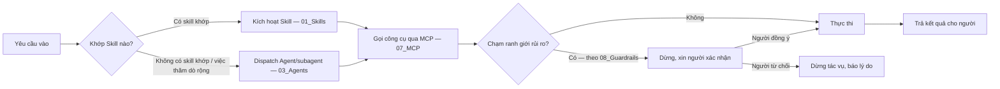

# 02 — Harness

**Ý nghĩa:** Khung điều phối tác vụ AI — nơi định nghĩa một yêu cầu (từ người hoặc từ lịch tự động) đi qua những bước nào để trở thành hành động thật: nhận yêu cầu → chọn Skill/Agent phù hợp → gọi công cụ (MCP) → dừng lại xin người xác nhận nếu chạm ranh giới rủi ro → trả kết quả. Thư mục này chỉ chứa **đặc tả điều phối**, không chứa định nghĩa kỹ năng (`01_Skills`), vai trò agent (`03_Agents`), hay cấu hình công cụ (`07_MCP`) — Harness dùng ba thứ đó, không thay thế chúng.

**Vì sao cần tài liệu này:** Không có tài liệu điều phối, mỗi skill/agent tự quyết định khi nào mình được gọi, khi nào cần dừng lại hỏi người — dẫn tới hai rủi ro đối lập: (1) chồng chéo, hai skill cùng nhận một việc theo cách khác nhau; (2) bỏ sót điểm dừng bắt buộc theo 42001 (AI tự kết luận đo lường/tự phê duyệt mà không ai để ý vì không skill nào "sở hữu" bước kiểm tra đó). Harness là nơi neo lại **thứ tự** và **điểm dừng** dùng chung cho mọi tác vụ, để từng skill/agent không phải tự phát minh lại.

---

## Harness là gì trong MANLAB-AIOS

Harness **không phải** một phần mềm phải xây từ đầu. Đây là lớp điều phối đã tồn tại sẵn dưới dạng cơ chế của Claude Code (CLI đang chạy trong repo này): khớp mô tả để chọn skill, gọi subagent, nạp công cụ MCP, và cổng permission trước khi thực thi. Nhiệm vụ của `02_Harness` là **đặc tả cách dùng** các cơ chế đó cho đúng ngữ cảnh ETV — không phải phát minh một orchestration engine riêng khi cơ chế sẵn có đã đủ.

Định nghĩa dùng trong repo này: **Harness = lớp nhận một tác vụ, quyết định tác vụ đó đi qua Skill/Agent/Workflow nào, theo thứ tự nào, và tại đâu phải dừng lại chờ người** — trước khi bất kỳ Skill hay Agent nào bắt đầu thực thi phần việc chuyên môn của nó.

---

## Phân biệt Harness với các tầng lân cận

Đây là nhầm lẫn phổ biến nhất khi thêm nội dung vào `07_AI_OPERATING_SYSTEM` — phân biệt theo câu hỏi:

| Tầng | Trả lời câu hỏi | Quan hệ với Harness |
|---|---|---|
| `01_Skills` | Kỹ năng này làm được gì, kích hoạt bằng mô tả nào? | Harness **gọi** skill theo kết quả khớp mô tả; không định nghĩa nội dung skill |
| `03_Agents` | Agent này có vai trò/quyền/công cụ gì? | Harness **điều phối** nhiều agent (khi nào dispatch, tuần tự hay song song); không định nghĩa quyền của từng agent |
| `04_Memory` | Tri thức nào, lưu ở đâu? | Harness **dùng** bộ nhớ để lắp ngữ cảnh (retrieval, nén); không lưu trữ tri thức — xem [`04_Memory/README.md`](../04_Memory/README.md#vai-trò-của-harness-và-mcp-trong-việc-truy-xuất-bộ-nhớ) |
| `07_MCP` | Công cụ nào, cấu hình máy chủ ra sao? | Harness **gọi** công cụ qua giao thức MCP; không cấu hình máy chủ MCP |
| `08_Guardrails` | Ranh giới nào AI không được vượt? | Harness **thực thi** điểm dừng do Guardrails định nghĩa (chặn/hỏi người tại đúng bước); không tự định nghĩa ranh giới |
| `11_Workflows` | Luồng nghiệp vụ nhiều bước có AI trông thế nào? | Workflow là **kịch bản nghiệp vụ cụ thể** (vd. luồng xử lý một phiếu yêu cầu hiệu chuẩn); Harness là **cơ chế điều phối chung** mà mọi Workflow chạy trên đó |

---

## Hiện trạng: Harness thực tế hôm nay là Claude Code

Không có orchestration engine riêng nào được xây cho MANLAB-AIOS. Cơ chế điều phối thật hiện nay đến từ Claude Code, cấu hình tại các vị trí sau:

| Bước điều phối | Cơ chế thật | Nơi cấu hình |
|---|---|---|
| Chọn Skill theo yêu cầu | Khớp mô tả trong frontmatter `SKILL.md` (`name:`, `description:`) với nội dung yêu cầu | [`01_Skills/`](../01_Skills/README.md), `.claude/skills/` (skill cục bộ, không thuộc repo governance) |
| Dispatch sang Agent/subagent | Công cụ `Agent` của Claude Code, chọn `subagent_type` phù hợp (Explore, general-purpose, …) | `03_Agents` (khi có định nghĩa agent chuyên biệt cho ETV) |
| Gọi công cụ ngoài | Giao thức MCP — nạp tool theo yêu cầu (`ToolSearch` cho tool hoãn tải), gọi trực tiếp cho tool đã có sẵn | [`07_MCP/`](../07_MCP/README.md) |
| Cổng permission trước hành động rủi ro | Chế độ permission của Claude Code (allow/ask/deny theo loại hành động) | `.claude/settings.local.json` (cấu hình cục bộ máy người dùng, không commit dữ liệu nhạy cảm) |
| Preview/chạy thử trước khi báo hoàn thành | `preview_start`/Browser pane theo cấu hình dev-server đặt tên | `.claude/launch.json` |
| Tự động hóa theo lịch | Cron/scheduled agent (khi cần) | `12_Policies` (chính sách), `11_Workflows` (kịch bản) — chưa có tác vụ lịch nào được định nghĩa cho ETV tại thời điểm viết tài liệu này |

Khi ETV cần một hành vi điều phối mà cơ chế trên không đáp ứng được (vd. hàng đợi tác vụ nhiều bước chạy độc lập với phiên chat), đó là lúc bổ sung đặc tả cụ thể vào thư mục này — không suy đoán trước nhu cầu chưa phát sinh.

---

## Vòng đời một tác vụ qua Harness

Điểm bắt buộc trong vòng đời này, áp dụng cho **mọi** tác vụ đi qua Harness, không riêng skill/agent nào:

1. **Không tự suy đoán khi không có skill/agent khớp rõ ràng** — báo lại cho người thay vì chọn đại một skill gần đúng.
2. **Điểm dừng xin người xác nhận (bước G)** áp dụng trước mọi hành động khó đảo ngược hoặc ảnh hưởng người khác (gửi văn bản, ghi đè tài liệu đã ban hành, thay đổi cấu hình chia sẻ) — danh sách chi tiết loại hành động thuộc phạm vi `08_Guardrails`, Harness chỉ đảm bảo điểm dừng **luôn được thực thi đúng chỗ**, không bị skill nào bỏ qua.
3. **Kết luận đo lường/phê duyệt chứng chỉ không bao giờ là bước cuối tự động** (bước H) — theo 42001, các bước này luôn kết thúc ở "trình người phê duyệt", có hồ sơ AIA theo `MP29_AI`, không tự chốt kết quả.

---

## Phạm vi cố ý chưa viết

Pipeline lắp ráp ngữ cảnh chi tiết (intent → truy xuất → nén, dùng Vector Search/Knowledge Graph để chọn đúng vài chục node/đoạn tài liệu liên quan thay vì nạp toàn bộ) **chưa được đặc tả tại đây**, vì hai lớp bộ nhớ đó (`08_KNOWLEDGE_GRAPH/09_Embedding` + `10_Vector_DB`, `08_Ontology`) hiện chỉ có khung thư mục, chưa có dữ liệu thật để tham chiếu khi thiết kế. Viết trước phần này là suy đoán cho một lớp chưa tồn tại — vi phạm nguyên tắc "một nguồn sự thật" của repo. Xem quyết định gốc tại [`04_Memory/README.md`](../04_Memory/README.md#vai-trò-của-harness-và-mcp-trong-việc-truy-xuất-bộ-nhớ). Cập nhật mục này khi Vector Search hoặc Knowledge Graph có dữ liệu thật đầu tiên.

Tương tự, đặc tả điều phối **đa agent chạy song song** (nhiều agent xử lý cùng lúc, cần khóa/đồng bộ trạng thái) chưa viết vì `03_Agents` hiện chưa có agent chuyên biệt nào được định nghĩa cho ETV — chỉ dùng agent mặc định của Claude Code. Viết khi có ít nhất một agent chuyên biệt cần điều phối cùng agent khác.

---

## KHÔNG lưu ở đây

- Dữ liệu cá nhân/mật trong prompt
- Cấu hình cho AI tự phê duyệt kết quả/chứng chỉ
- Nội dung skill (thuộc `01_Skills`), định nghĩa vai trò/quyền agent (thuộc `03_Agents`), cấu hình máy chủ MCP (thuộc `07_MCP`) — chỉ trỏ đường dẫn tới các tầng đó
- Danh sách ranh giới rủi ro chi tiết theo loại hành động — thuộc `08_Guardrails`, Harness chỉ tham chiếu và đảm bảo thực thi
- Kịch bản nghiệp vụ cụ thể theo từng thủ tục (vd. luồng xử lý một loại phiếu yêu cầu) — thuộc `11_Workflows`

**Lưu ý:** 42001: AI KHÔNG tự ra kết luận đo lường; mọi agent triển khai phải có hồ sơ AIA theo MP29.
